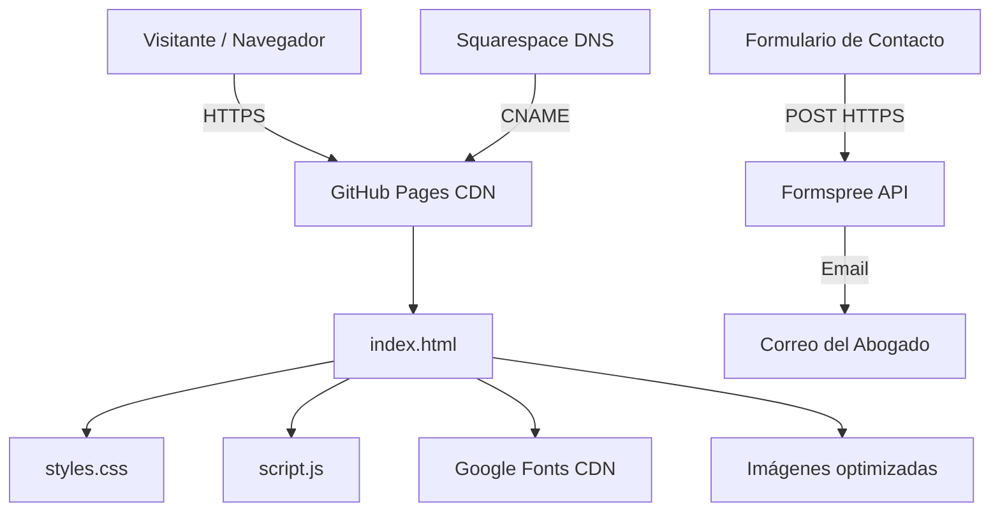
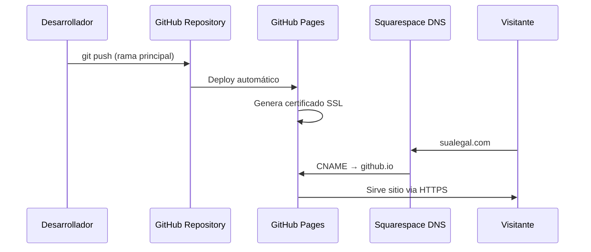

# Design Document

## Overview

Este documento describe el diseño técnico del sitio web estático profesional para un abogado especializado en gerencia de familia. El sitio es una single-page application (SPA estática) construida exclusivamente con HTML, CSS y JavaScript vanilla, desplegada en GitHub Pages con dominio personalizado.

### Decisiones de Diseño Clave

1. **Sin frameworks ni bundlers**: Se utilizan HTML, CSS y JS nativos para eliminar dependencias de compilación, simplificar el despliegue y maximizar la velocidad de carga.
2. **CSS custom properties (variables)**: La paleta de colores se define como variables CSS en `:root` para mantener consistencia y facilitar cambios futuros.
3. **Mobile-first responsive design**: Se parte del layout móvil y se agregan breakpoints para tablet (768px) y desktop (1200px).
4. **Intersection Observer API**: Se usa para detectar la sección visible y resaltar el enlace activo en la navegación, evitando listeners de scroll pesados.
5. **Formspree para formulario de contacto**: Servicio externo gratuito que maneja el envío de formularios sin requerir backend propio.

## Architecture

### Diagrama de Arquitectura de Alto Nivel



### Estructura de Archivos

```
sualegal/
├── index.html          # Página principal (single-page)
├── styles.css          # Estilos globales con variables CSS
├── script.js           # Navegación, validación, interactividad
├── CNAME               # Dominio personalizado para GitHub Pages
├── assets/
│   └── images/         # Imágenes optimizadas (< 200KB c/u)
├── .github/
│   └── workflows/      # (Opcional) GitHub Actions para validación
└── README.md           # Documentación del proyecto
```

### Flujo de Despliegue



## Components and Interfaces

### 1. Componente HTML (`index.html`)

**Responsabilidad**: Estructura semántica del documento, contenido, metadatos SEO y Open Graph.

**Estructura de secciones**:

```html
<!DOCTYPE html>
<html lang="es">
<head>
    <!-- Meta tags SEO y Open Graph -->
    <!-- Google Fonts preconnect + stylesheet -->
    <!-- styles.css -->
</head>
<body>
    <header>         <!-- Navegación sticky -->
        <nav>        <!-- Links de navegación + hamburguesa -->
    </header>
    <main>
        <section id="inicio">     <!-- Hero -->
        <section id="servicios">  <!-- Servicios -->
        <section id="acerca">     <!-- Acerca del abogado -->
        <section id="contacto">   <!-- Contacto + formulario -->
    </main>
    <footer>         <!-- Pie de página -->
    <!-- script.js -->
</body>
</html>
```

**Interfaces**:
- Los IDs de sección (`inicio`, `servicios`, `acerca`, `contacto`) sirven como API interna para navegación por anclas.
- El formulario expone `action` apuntando a Formspree y `method="POST"`.

### 2. Componente CSS (`styles.css`)

**Responsabilidad**: Presentación visual, responsive design, paleta de colores, tipografía, estados interactivos.

**Arquitectura CSS**:

```css
/* 1. Variables CSS (Custom Properties) */
:root {
    --color-primary: #1B3A5C;
    --color-secondary: #C9A84C;
    --color-bg-light: #FAFAFA;
    --color-bg-alt: #F0F0F0;
    --color-text: #2D2D2D;
    --font-heading: 'Playfair Display', serif;
    --font-body: 'Open Sans', sans-serif;
    --nav-height: 70px;
    --max-width: 1920px;
}

/* 2. Reset y base */
/* 3. Tipografía */
/* 4. Layout y contenedores */
/* 5. Componentes (nav, hero, servicios, acerca, contacto, footer) */
/* 6. Estados interactivos (hover, focus, active) */
/* 7. Media queries (mobile-first) */
```

**Breakpoints**:
| Rango | Categoría | Layout |
|-------|-----------|--------|
| 320px - 767px | Móvil | 1 columna, menú hamburguesa |
| 768px - 1199px | Tablet | 2 columnas servicios, nav horizontal |
| 1200px - 1920px | Desktop | 3 columnas servicios, layout completo |
| > 1920px | Extra grande | Contenido centrado, max-width 1920px |

### 3. Componente JavaScript (`script.js`)

**Responsabilidad**: Interactividad del sitio sin dependencias externas.

**Módulos funcionales**:

| Módulo | Función | API/Eventos |
|--------|---------|-------------|
| `navigation` | Menú hamburguesa toggle, cerrar al seleccionar | `click`, `keydown` |
| `smoothScroll` | Desplazamiento suave con offset de nav | `click` en enlaces `[href^="#"]` |
| `activeSection` | Resaltar enlace de sección visible | `IntersectionObserver` |
| `formValidation` | Validación de campos del formulario | `submit`, `input`, `blur` |
| `formSubmission` | Envío asíncrono a Formspree con feedback | `fetch` API |
| `dynamicYear` | Año actual en footer copyright | `DOMContentLoaded` |

**Interface del módulo de validación de formulario**:

```javascript
// Validación de campos
function validateField(field) → { valid: boolean, message: string }
function validateForm(form) → { valid: boolean, errors: Map<fieldName, message> }
function showError(field, message) → void
function clearError(field) → void

// Reglas de validación
const VALIDATION_RULES = {
    nombre: { required: true, maxLength: 100 },
    email: { required: true, pattern: EMAIL_REGEX },
    telefono: { required: false, maxLength: 20 },
    mensaje: { required: true, maxLength: 1000 }
}
```

**Interface del módulo de envío**:

```javascript
// Envío del formulario
async function submitForm(formData) → { success: boolean, message: string }
function showSuccessMessage(container) → void
function showErrorMessage(container, message) → void
```

### 4. Componente de Assets

**Responsabilidad**: Recursos visuales optimizados.

**Restricciones**:
- Cada imagen individual: < 200KB
- Formatos recomendados: WebP con fallback JPEG
- Foto profesional del abogado: mínimo 200x200px
- Total de assets: contribuye al límite de 1MB total de página

### 5. Componente de Configuración DNS/Hosting

**Responsabilidad**: Resolución de dominio y despliegue.

**Archivos**:
- `CNAME`: contiene el dominio personalizado completo
- Configuración en GitHub: Pages habilitado, HTTPS forzado

**DNS en Squarespace**:
- Registro CNAME apuntando a `<usuario>.github.io`
- O registros A apuntando a IPs de GitHub Pages

## Data Models

### Modelo de Servicio Legal

```typescript
interface ServicioLegal {
    icono: string;           // Clase de ícono o SVG inline
    titulo: string;          // Máx 40 caracteres
    descripcion: string;     // Máx 50 palabras
}
```

### Modelo de Información de Contacto

```typescript
interface InformacionContacto {
    email: string;           // Dirección de correo electrónico
    telefono: string;        // Número con formato internacional
    whatsapp?: string;       // Número WhatsApp (opcional)
    direccion?: string;      // Dirección física (opcional)
    redesSociales?: RedSocial[];
}

interface RedSocial {
    plataforma: string;      // "linkedin" | "facebook" | etc.
    url: string;             // URL completa del perfil
    etiqueta: string;        // Texto accesible para el enlace
}
```

### Modelo de Campo de Formulario

```typescript
interface CampoFormulario {
    nombre: string;          // Atributo name del input
    tipo: "text" | "email" | "tel" | "textarea";
    requerido: boolean;
    maxLength: number;
    patron?: RegExp;         // Patrón de validación (email)
    mensajeError: string;    // Mensaje cuando falla validación
}

interface ResultadoValidacion {
    valido: boolean;
    mensaje: string;         // Vacío si es válido
}

interface ResultadoEnvio {
    exitoso: boolean;
    mensaje: string;         // Mensaje para mostrar al usuario
}
```

### Modelo de Configuración del Sitio

```typescript
interface ConfiguracionSitio {
    formspreeEndpoint: string;  // URL del endpoint de Formspree
    navHeight: number;          // Altura de nav para offset de scroll
    breakpoints: {
        mobile: number;         // 768
        desktop: number;        // 1200
    };
    colores: {
        primary: string;
        secondary: string;
        bgLight: string;
        bgAlt: string;
        text: string;
    };
}
```


## Correctness Properties

*A property is a characteristic or behavior that should hold true across all valid executions of a system — essentially, a formal statement about what the system should do. Properties serve as the bridge between human-readable specifications and machine-verifiable correctness guarantees.*

The primary testable logic in this static website is the **form validation module** — a set of pure functions that take user input and return validation results. This logic varies meaningfully with input (empty strings, whitespace, valid/invalid emails, length boundaries) and benefits from property-based testing to catch edge cases.

### Property 1: Required field rejection

*For any* string that is empty or composed entirely of whitespace characters, the `validateField` function SHALL return `{ valid: false }` with an appropriate error message when the field is marked as required.

**Validates: Requirements 7.7**

### Property 2: Email format validation

*For any* string that does not match a valid email format (lacks `@`, has invalid domain structure, contains illegal characters), the `validateField` function for the email field SHALL return `{ valid: false }` with an error message. Conversely, *for any* string matching the standard email format (local@domain.tld), validation SHALL return `{ valid: true }`.

**Validates: Requirements 7.7**

### Property 3: Max length enforcement

*For any* string whose character count exceeds the `maxLength` defined for a field (100 for nombre, 20 for teléfono, 1000 for mensaje), the `validateField` function SHALL return `{ valid: false }`. *For any* string within the limit, this rule SHALL not cause rejection.

**Validates: Requirements 7.6, 7.7**

### Property 4: Valid input acceptance

*For any* non-empty, non-whitespace-only string that is within the maximum length and (if email) matches the email pattern, the `validateField` function SHALL return `{ valid: true }`.

**Validates: Requirements 7.7**

## Error Handling

### Errores de Formulario de Contacto

| Escenario | Comportamiento | Mensaje al Usuario |
|-----------|---------------|-------------------|
| Campo requerido vacío | Prevenir envío, mostrar error inline | "Este campo es obligatorio" |
| Email con formato inválido | Prevenir envío, mostrar error inline | "Por favor ingrese un correo electrónico válido" |
| Campo excede longitud máxima | Prevenir envío, mostrar error inline | "Máximo {n} caracteres permitidos" |
| Error de red al enviar | Mostrar mensaje de error general | "No se pudo enviar el mensaje. Por favor intente nuevamente o use los otros canales de contacto." |
| Servicio Formspree no disponible | Mismo que error de red | Mismo mensaje + mostrar datos de contacto alternativos |
| Envío exitoso | Mostrar confirmación, limpiar formulario | "¡Mensaje enviado! Nos pondremos en contacto pronto." |

### Errores de Navegación

| Escenario | Comportamiento |
|-----------|---------------|
| Sección destino no existe | No hacer scroll, no provocar error JS |
| JavaScript deshabilitado | Enlaces de ancla funcionan nativamente (degradación grácil) |
| IntersectionObserver no soportado | Nav funciona sin highlight activo (progressive enhancement) |

### Estrategia de Degradación Grácil

1. **Sin JavaScript**: El sitio mantiene toda la información visible. Los enlaces de ancla funcionan nativamente. El formulario puede enviarse mediante la acción HTML estándar de Formspree.
2. **Sin CSS**: El contenido es legible gracias a la estructura semántica HTML.
3. **Conexión lenta**: Las fuentes de Google cargan con `font-display: swap`, mostrando texto inmediatamente con fuentes del sistema.

## Testing Strategy

### Enfoque de Testing Dual

Este proyecto combina **tests unitarios** para verificar ejemplos específicos y **tests de propiedad** para verificar comportamiento universal del módulo de validación.

### Property-Based Testing (PBT)

**Librería**: [fast-check](https://github.com/dubzzz/fast-check) (JavaScript)

**Configuración**:
- Mínimo 100 iteraciones por test de propiedad
- Cada test referencia la propiedad del documento de diseño

**Tests de propiedad a implementar**:

| Property | Descripción | Tag |
|----------|------------|-----|
| 1 | Campos requeridos rechazan strings vacíos/whitespace | Feature: sualegal-website, Property 1: Required field rejection |
| 2 | Validación de formato de email | Feature: sualegal-website, Property 2: Email format validation |
| 3 | Enforcement de longitud máxima | Feature: sualegal-website, Property 3: Max length enforcement |
| 4 | Inputs válidos son aceptados | Feature: sualegal-website, Property 4: Valid input acceptance |

### Unit Tests (Example-Based)

**Librería**: Jest o Vitest

**Cobertura de tests unitarios**:

1. **Estructura HTML/SEO**:
   - Existencia de meta tags SEO y Open Graph
   - Estructura semántica correcta (un solo h1, jerarquía de headings)
   - Atributos `alt` en todas las imágenes
   - Labels asociados a campos de formulario
   - Atributos ARIA y accesibilidad

2. **Navegación**:
   - Toggle del menú hamburguesa
   - Cierre del menú al seleccionar enlace
   - Smooth scroll con offset correcto
   - Highlight de sección activa

3. **Formulario de contacto**:
   - Validación de ejemplos específicos (email "test@example.com" → válido)
   - Mensajes de error correctos por tipo de error
   - Feedback de envío exitoso
   - Feedback de error de red

4. **Footer**:
   - Año dinámico correcto
   - Consistencia de datos de contacto con sección principal
   - Enlaces sociales abren en nueva pestaña

### Integration/E2E Tests

**Herramienta**: Playwright o Cypress

1. **Responsive layout**: Verificar en viewports 320px, 768px, 1200px, 1920px
2. **Navegación completa**: Click en cada enlace, verificar scroll a sección correcta
3. **Formulario end-to-end**: Llenar y enviar formulario (mock de Formspree)
4. **Accesibilidad**: Navegación completa por teclado
5. **Performance**: Verificar peso total < 1MB

### Smoke Tests

1. Archivo CNAME existe con dominio correcto
2. Todas las imágenes < 200KB
3. Google Fonts cargadas correctamente
4. CSS variables definidas con colores correctos de paleta

### Herramientas de Validación Complementarias

- **Lighthouse**: Auditoría automatizada de performance, accesibilidad, SEO
- **axe-core**: Validación WCAG 2.1 AA automatizada
- **HTML Validator (W3C)**: Validación de markup semántico
- **PageSpeed Insights**: Verificación de peso y velocidad de carga
